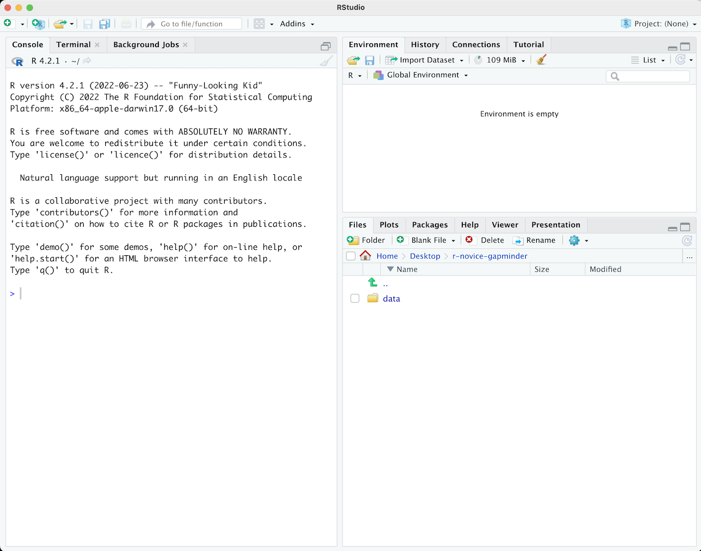
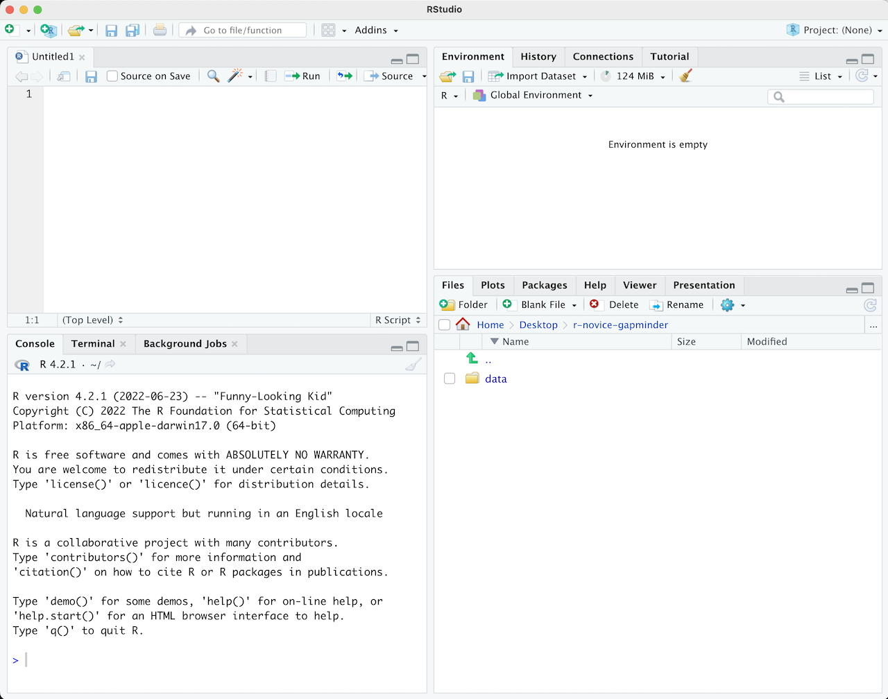

::::::::::::::::::::::::::::::::::::::: objectives

- RStudioの各ペインの目的と使用方法を説明する
- RStudio内のボタンやオプションの場所を見つける
- 変数を定義する
- データを変数に代入する
- インタラクティブなRセッションでワークスペースを管理する
- 数学および比較演算子を使用する
- 関数を呼び出す
- パッケージを管理する

::::::::::::::::::::::::::::::::::::::::::::::::::

:::::::::::::::::::::::::::::::::::::::: questions

- RStudio内でどのように操作するのか？
- Rとの対話方法は？
- 環境をどのように管理するのか？
- パッケージをどのようにインストールするのか？

::::::::::::::::::::::::::::::::::::::::::::::::::


## ワークショップを始める前に

ワークショップで使用する一部のパッケージが正しくインストールされない（または全くインストールされない）場合があるため、お使いのマシンにRとRStudioの最新バージョンがインストールされていることを確認してください。

- [最新バージョンのRをこちらからダウンロードしてインストールしてください](https://www.r-project.org/)
- [RStudioをこちらからダウンロードしてインストールしてください](https://www.rstudio.com/products/rstudio/download/#download)


## なぜRとRStudioを使うのか？

Software CarpentryワークショップのRセクションへようこそ！

科学は多段階のプロセスです。
実験を設計してデータを収集した後、本当の楽しみは分析から始まります！このレッスンでは、R言語の基本を教えるとともに、科学プロジェクトのためのコードを整理するベストプラクティスを学び、作業をより簡単にする方法を紹介します。

データを分析するためにMicrosoft ExcelやGoogleスプレッドシートを使用することもできますが、これらのツールは柔軟性やアクセス性に限界があります。さらに、元データの変更や探索の手順を共有することが難しいため、これは「再現可能な」研究にとって重要なポイントです（[再現可能な研究についてはこちら](https://journals.plos.org/ploscompbiol/article?id=10.1371/journal.pcbi.1003285)）。

したがって、このレッスンでは、RとRStudioを使用してデータの探索を始める方法を学びます。RプログラムはWindows、Mac、Linuxオペレーティングシステムで利用可能で、上記のリンクから無料でダウンロードできます。Rを実行するために必要なのはRプログラムだけです。

しかし、Rをより使いやすくするために、同じくダウンロードしたRStudioというプログラムを使用します。RStudioは無料でオープンソースの統合開発環境（IDE）で、組み込みエディタを提供し、すべてのプラットフォームで動作します（サーバー上でも利用可能）。バージョン管理やプロジェクト管理との統合など、多くの利点があります。

## 概要  

生データから始め、探索的な分析を行い、結果をグラフでプロットする方法を学びます。この例では、[gapminder.org](https://www.gapminder.org)のデータセットを使用し、時間を通じた各国の人口情報を扱います。データをRに読み込むことができますか？セネガルの人口をプロットできますか？アジア大陸の国々の平均所得を計算できますか？このレッスンの終わりまでに、これらの国々の人口を1分以内にプロットできるようになります！


**基本レイアウト**

RStudioを初めて開くと、次の3つのパネルが表示されます：

- インタラクティブなRコンソール/ターミナル（左全体）
- 環境/履歴/接続（右上のタブ）
- ファイル/プロット/パッケージ/ヘルプ/ビューア（右下のタブ）

{alt='RStudioのレイアウト'}

ファイル（例えばRスクリプト）を開くと、上部左にエディタパネルも表示されます。

{alt='RStudioで.Rファイルを開いたレイアウト'}

:::::::::::::::::::::::::::::::::::::::::  callout

## Rスクリプト

Rコンソールに書いたコマンドはファイルに保存し、再実行することができます。このようなRコードを含むファイルをRスクリプトと呼びます。Rスクリプトは名前の末尾が`.R`となっており、それがRスクリプトであることを示します。

::::::::::::::::::::::::::::::::::::::::::::::::::

## RStudio内でのワークフロー

RStudio内で作業する主な方法は2つあります：

1. インタラクティブなRコンソール内でテストや試行を行い、そのコードをコピーして.Rファイルに貼り付け、後で実行する。
   - 小規模なテストや初期の段階では効果的です。
   - しかし、すぐに手間がかかるようになります。
2. 最初から.Rファイルに記述し、RStudioのショートカットキーを使用して「Run」コマンドを実行し、現在の行、選択した行、または変更した行をインタラクティブなRコンソールに送る。
   - これは作業を始める良い方法です。すべてのコードが後で使用するために保存されます。
   - RStudio内またはRの`source()`関数を使用して作成したファイルを実行できます。

:::::::::::::::::::::::::::::::::::::::::  callout

## ヒント：コードのセグメントを実行する

RStudioでは、エディタウィンドウからコードを実行する柔軟性があります。ボタン、メニューオプション、およびキーボードショートカットがあります。現在の行を実行するには、次の方法があります：

1. エディタパネルの上部にある「Run」ボタンをクリックする
2. 「Code」メニューから「Run Lines」を選択する
3. WindowsまたはLinuxでは<kbd>Ctrl</kbd>\+<kbd>Return</kbd>、OS Xでは<kbd>⌘</kbd>\+<kbd>Return</kbd>を押す
   （このショートカットはボタンの上にマウスをホバーさせると確認できます）。コードブロックを実行するには、選択して「Run」をクリックします。
   最近実行したコードブロックを修正した場合、セクションを再選択して「Run」を押す必要はありません。次のボタン「Re-run the previous region」を使用すると、修正を含む前のコードブロックを実行できます。

::::::::::::::::::::::::::::::::::::::::::::::::::

## R入門

Rでの作業の多くは、インタラクティブなRコンソール内で行います。ここでは、すべてのコードを実行し、Rスクリプトファイルに追加する前にアイデアを試すのに便利な環境です。RStudioのコンソールは、コマンドライン環境で`R`と入力した場合と同じです。

Rのインタラクティブセッションを開くと、最初に情報が表示され、その後に「>」と点滅するカーソルが現れます。これは、シェルレッスンで学んだシェル環境と多くの点で似ています。「Read, evaluate, print loop」（読み取り、評価、印刷ループ）の考え方に基づいて動作します：コマンドを入力すると、Rがそれを実行し、結果を返します。

## Rを計算機として使う

Rで最も簡単なことは、算術を行うことです：


``` r
1 + 100
```

``` output
[1] 101
```

Rは答えを表示し、その前に"[1]"を付けます。[1]はコンソールに表示される行の最初の要素のインデックスを示します。ベクトルのインデックスについての詳細は、[エピソード6：データのサブセット化](https://swcarpentry.github.io/r-novice-gapminder/06-data-subsetting/index.html)を参照してください。

不完全なコマンドを入力すると、R

は完了を待機します。Unix Shellのbashに慣れている場合、この動作をbashで見たことがあるかもしれません。

```r
> 1 +
```

```output
+
```

「>」ではなく「+」が表示された場合、Rはコマンドの完了を待機しています。コマンドをキャンセルしたい場合は<kbd>Esc</kbd>を押すと、RStudioは「>」プロンプトに戻ります。

:::::::::::::::::::::::::::::::::::::::::  callout

## ヒント：コマンドのキャンセル

コマンドラインからRを使用している場合は、RStudioの代わりに<kbd>Esc</kbd>ではなく<kbd>Ctrl</kbd>\+<kbd>C</kbd>を使用してコマンドをキャンセルする必要があります。これはMacユーザーにも適用されます！

コマンドのキャンセルは、不完全なコマンドを終了させるだけでなく、予想以上に時間がかかる場合にコードの実行を停止したり、現在書いているコードを削除したりするためにも役立ちます。

::::::::::::::::::::::::::::::::::::::::::::::::::

Rを計算機として使用する場合、演算の順序は学校で学んだものと同じです。

優先順位が高いものから低いものへ：

- 括弧：`(`, `)`
- 累乗：`^`または`**`
- 乗算：`*`
- 除算：`/`
- 加算：`+`
- 減算：`-`


``` r
3 + 5 * 2
```

``` output
[1] 13
```

評価の順序を変更したい場合や意図を明確にしたい場合は、括弧を使用してグループ化します。


``` r
(3 + 5) * 2
```

``` output
[1] 16
```

必要ない場合は煩雑になりますが、意図を明確にできます。他の人が後でコードを読むかもしれないことを忘れないでください。


``` r
(3 + (5 * (2 ^ 2))) # 読みにくい
3 + 5 * 2 ^ 2       # 規則を覚えていれば明快
3 + 5 * (2 ^ 2)     # 規則を忘れた場合はこれが助けになる
```

各コード行の後にあるテキストは「コメント」と呼ばれます。ハッシュ記号`#`の後に続く内容は、コードを実行する際にRによって無視されます。

非常に小さいまたは大きい数値は、科学表記法で表示されます：


``` r
2/10000
```

``` output
[1] 2e-04
```

これは「`10^XX`で掛ける」という短縮形です。したがって、`2e-4`は`2 * 10^(-4)`の短縮形です。

科学表記法で数値を書くこともできます：


``` r
5e3  # マイナスがない点に注意
```

``` output
[1] 5000
```

## 数学関数

Rには多くの組み込み数学関数があります。関数を呼び出すには、関数名を入力し、その後に開き括弧と閉じ括弧を続けます。関数は引数を入力として受け取ります。関数の括弧内に入力したものはすべて引数と見なされます。関数によって引数の数は異なり、引数を必要としないものから複数の引数を必要とするものまであります。例：


``` r
getwd() # 絶対パスを返す
```

この例では引数は不要ですが、以下の数学関数では結果を計算するために値を渡す必要があります。


``` r
sin(1)  # 三角関数
```

``` output
[1] 0.841471
```


``` r
log(1)  # 自然対数
```

``` output
[1] 0
```


``` r
log10(10) # 常用対数（底10）
```

``` output
[1] 1
```


``` r
exp(0.5) # e^(1/2)
```

``` output
[1] 1.648721
```

Rのすべての関数を覚えようとする必要はありません。Googleで検索するか、関数名の最初の数文字を覚えていれば、RStudioのタブ補完機能を使うことができます。

RStudioの大きな利点の一つは、オートコンプリート機能があることです。これにより、関数、引数、および受け取る値を簡単に調べることができます。

コマンド名の前に`?`を付けると、そのコマンドのヘルプページが開きます。RStudioを使用している場合、'Help'ペインに表示されます。ターミナルでRを使用している場合は、ブラウザでヘルプページが開きます。ヘルプページにはコマンドの詳細な説明と動作の仕組みが含まれています。ページの下部までスクロールすると、通常、コマンドの使用例が掲載されています。後ほど例を見ていきます。

## 比較演算

Rでは比較を行うこともできます：


``` r
1 == 1  # 等しい（等号が2つ、"等しい"と読む）
```

``` output
[1] TRUE
```


``` r
1 != 2  # 等しくない（"等しくない"と読む）
```

``` output
[1] TRUE
```


``` r
1 < 2  # より小さい
```

``` output
[1] TRUE
```


``` r
1 <= 1  # 以下
```

``` output
[1] TRUE
```


``` r
1 > 0  # より大きい
```

``` output
[1] TRUE
```


``` r
1 >= -9 # 以上
```

``` output
[1] TRUE
```

:::::::::::::::::::::::::::::::::::::::::  callout

## ヒント：数値の比較

数値を比較する際の注意点として、整数（小数を含まない数値型）以外を比較する場合は、`==`を使用しないでください。

コンピュータは小数を特定の精度でしか表現できないため、Rが表示する際に同じに見える2つの数値が、内部表現では異なる場合があります。このわずかな差異は「数値計算誤差（Machine numeric tolerance）」と呼ばれます。

代わりに`all.equal`関数を使用してください。

さらに詳しく知りたい方はこちら：[http://floating-point-gui.de/](https://floating-point-gui.de/)

::::::::::::::::::::::::::::::::::::::::::::::::::

## 変数と代入

代入演算子`<-`を使用して、値を変数に格納できます：


``` r
x <- 1/40
```

代入は値を表示しません。代わりに、それを後で使用するために**変数**というものに格納します。この場合、`x`には値`0.025`が格納されています：


``` r
x
```

``` output
[1] 0.025
```

正確には、この格納された値は[浮動小数点数](https://en.wikipedia.org/wiki/Floating_point)と呼ばれる分数の*10進数近似値*です。

RStudioの右上ペインにある`Environment`タブを確認すると、`x`とその値が表示されていることがわかります。変数`x`は、数値を期待する計算の中で数値の代わりに使用できます：


``` r
log(x)
```

``` output
[1] -3.688879
```

また、変数には再代入も可能です：


``` r
x <- 100
```

以前は`x`に0.025が格納されていましたが、現在は100が格納されています。

代入値には、代入先の変数を含めることもできます：


``` r
x <- x + 1 # RStudioの右上タブでxの説明が更新されることに注目
y <- x * 2
```

代入の右辺には有効なR式を使用できます。右辺は代入が行われる前に*完全に評価*されます。

変数名には、文字、数字、アンダースコア、ピリオドを含めることができますが、スペースは含められません。また、変数名は文字またはピリオドで始める必要があります（数字やアンダースコアでは始めることはできません）。ピリオドで始まる変数は隠し変数と見なされます。

長い変数名については、異なる人が異なる規約を使用します。その例として：

- periods.between.words
- underscores_between_words
- camelCaseToSeparateWords

どれを使用するかは自由ですが、**一貫性を保つ**ことが重要です。

代入には`=`演算子を使用することも可能です：


``` r
x = 1/40
```

しかし、これはRユーザーの間ではあまり一般的ではありません。最も重要なのは、使用する演算子に**一貫性を持つ**ことです。`<-`を使用したほうが混乱が少ない場合もあり、コミュニティでは最も一般的に使われています。そのため、`<-`を使用することを推奨します。

:::::::::::::::::::::::::::::::::::::::  challenge

## チャレンジ 1

次の中で有効なRの変数名はどれですか？


``` r
min_height
max.height
_age
.mass
MaxLength
min-length
2widths
celsius2kelvin
```

:::::::::::::::  solution

## チャレンジ1の解答

次のものはR変数として使用できます：


``` r
min_height
max.height
MaxLength
celsius2kelvin
```

次のものは隠し変数を作成します：


``` r
.mass
```

次のものは変数を作成できません：


``` r
_age
min-length
2widths
```

:::::::::::::::::::::::::

::::::::::::::::::::::::::::::::::::::::::::::::::

## ベクトル化

Rの特徴の1つに、Rが**ベクトル化**されているという点があります。つまり、変数や関数にベクトルを値として持たせることができます。物理学や数学におけるベクトルとは異なり、Rにおけるベクトルは同じデータ型の値が順序付けられた集合を指します。例：


``` r
1:5
```

``` output
[1] 1 2 3 4 5
```

``` r
2^(1:5)
```

``` output
[1]  2  4  8 16 32
```

``` r
x <- 1:5
2^x
```

``` output
[1]  2  4  8 16 32
```

この機能は非常に強力で、今後のレッスンでさらに詳しく説明します。

## 環境の管理

Rセッションとやり取りするための便利なコマンドがいくつかあります。

`ls`を使用すると、グローバル環境（現在のRセッション）に保存されているすべての変数と関数を一覧表示できます：


``` r
ls()
```


``` output
[1] "x" "y"
```

:::::::::::::::::::::::::::::::::::::::::  callout

## ヒント：隠しオブジェクト

シェルと同様に、`ls`ではデフォルトで"."で始まる変数や関数は表示されません。すべてのオブジェクトを一覧表示するには、`ls(all.names=TRUE)`と入力してください。

::::::::::::::::::::::::::::::::::::::::::::::::::

ここでは、`ls`に引数を渡していませんが、関数を呼び出すために括弧は必要です。

`ls`だけを入力すると、オブジェクト一覧ではなくコードが表示されます：


``` r
ls
```

``` output
function (name, pos = -1L, envir = as.environment(pos), all.names = FALSE, 
    pattern, sorted = TRUE) 
{
    if (!missing(name)) {
        pos <- tryCatch(name, error = function(e) e)
        if (inherits(pos, "error")) {
            name <- substitute(name)
            if (!is.character(name)) 
                name <- deparse(name)
            warning(gettextf("%s converted to character string", 
                sQuote(name)), domain = NA)
            pos <- name
        }
    }
    all.names <- .Internal(ls(envir, all.names, sorted))
    if (!missing(pattern)) {
        if ((ll <- length(grep("[", pattern, fixed = TRUE))) && 
            ll != length(grep("]", pattern, fixed = TRUE))) {
            if (pattern == "[") {
                pattern <- "\\["
                warning("replaced regular expression pattern '[' by  '\\\\['")
            }
            else if (length(grep("[^\\\\]\\[<-", pattern))) {
                pattern <- sub("\\[<-", "\\\\\\[<-", pattern)
                warning("replaced '[<-' by '\\\\[<-' in regular expression pattern")
            }
        }
        grep(pattern, all.names, value = TRUE)
    }
    else all.names
}
<bytecode: 0x55c229e87d60>
<environment: namespace:base>
```

これはどういうことでしょうか？

Rではすべてがオブジェクトであり、オブジェクト名だけを入力すると、その内容が表示されます。先ほど作成したオブジェクト`x`には1, 2, 3, 4, 5が格納されています：


``` r
x
```

``` output
[1] 1 2 3 4 5
```

オブジェクト`ls`には、`ls`関数を動作させるRコードが格納されています！関数の仕組みや作成方法については後のレッスンで説明します。

不要になったオブジェクトを削除するには、`rm`を使用します：


``` r
rm(x)
```

多くのオブジェクトが環境にあり、それらをすべて削除したい場合は、`ls`の結果を`rm`関数に渡します：


``` r
rm(list = ls())
```

この場合、2つの関数を組み合わせています。演算の順序と同様に、最も内側の括弧内の内容が最初に評価されます。

この場合、`ls`の結果が`rm`の`list`引数として使用されるよう指定しています。引数に値を名前で割り当てる場合、**必ず`=`演算子を使用**する必要があります！

代わりに`<-`を使用すると、予期しない副作用が発生するか、エラーメッセージが表示される可能性があります：


``` r
rm(list <- ls())
```

``` error
Error in rm(list <- ls()): ... must contain names or character strings
```

:::::::::::::::::::::::::::::::::::::::::  callout

## ヒント：警告とエラー

Rが予期しない動作をした場合は注意してください！エラーはRが計算を続行できない場合に発生します。一方、警告は通常、関数が実行されたものの、期待通りに動作しなかったことを意味します。

どちらの場合も、Rが表示するメッセージには問題を解決するための手がかりが含まれていることが多いです。

::::::::::::::::::::::::::::::::::::::::::::::::::

## Rパッケージ

Rにはパッケージを作成することで関数を追加することができます。また、他の人が作成したパッケージを利用することも可能です。この執筆時点で、CRAN（Comprehensive R Archive Network）には10,000を超えるパッケージが利用可能です。RとRStudioにはパッケージを管理するための機能があります：

- インストールされているパッケージを確認するには、`installed.packages()`を入力します。
- パッケージをインストールするには、`install.packages("packagename")`と入力します。ここで`packagename`はパッケージ名で、引用符で囲みます。
- インストール済みのパッケージを更新するには、`update.packages()`を入力します。
- パッケージを削除するには、`remove.packages("packagename")`を使用します。
- パッケージを利用可能にするには、`library(packagename)`を入力します。

RStudioの右下ペインの「Packages」タブからもパッケージを表示、ロード、デタッチすることができます。このタブをクリックすると、インストール済みのパッケージがチェックボックス付きで表示されます。パッケージ名の横にあるチェックボックスがオンの場合、そのパッケージはロードされており、オフの場合はロードされていません。空のボックスをクリックするとそのパッケージがロードされ、チェックボックスをクリックするとパッケージがデタッチされます。

また、「Packages」タブの上部にある「Install」ボタンと「Update」ボタンを使用して、パッケージをインストールおよび更新できます。

:::::::::::::::::::::::::::::::::::::::  challenge

## チャレンジ 2

次のプログラムの各文の後で、各変数の値はどうなるでしょうか？


``` r
mass <- 47.5
age <- 122
mass <- mass * 2.3
age <- age - 20
```

:::::::::::::::  solution

## チャレンジ2の解答


``` r
mass <- 47.5
```

この時点で変数`mass`の値は47.5になります。


``` r
age <- 122
```

この時点で変数`age`の値は122になります。


``` r
mass <- mass * 2.3
```

既存の値47.5に2.3を掛け、新しい値109.25を`mass`に格納します。


``` r
age <- age - 20
```

既存の値122から20を引き、新しい値102を`age`に格納します。

:::::::::::::::::::::::::

::::::::::::::::::::::::::::::::::::::::::::::::::

:::::::::::::::::::::::::::::::::::::::  challenge

## チャレンジ 3

前のチャレンジのコードを実行し、massとageを比較するコマンドを書きなさい。massはageより大きいですか？

:::::::::::::::  solution

## チャレンジ3の解答

この質問に答える方法の1つとして、次のように`>`を使用できます：


``` r
mass > age
```

``` output
[1] TRUE
```

このコードは、109.25が102より大きいため、論理値`TRUE`を返すはずです。

:::::::::::::::::::::::::

::::::::::::::::::::::::::::::::::::::::::::::::::

:::::::::::::::::::::::::::::::::::::::  challenge

## チャレンジ 4

作業環境を整理し、massとageの変数を削除しなさい。

:::::::::::::::  solution

## チャレンジ4の解答

このタスクを達成するには、`rm`コマンドを使用します：


``` r
rm(age, mass)
```

:::::::::::::::::::::::::

::::::::::::::::::::::::::::::::::::::::::::::::::

:::::::::::::::::::::::::::::::::::::::  challenge

## チャレンジ 5

以下のパッケージをインストールしなさい：`ggplot2`, `plyr`, `gapminder`

:::::::::::::::  solution

## チャレンジ5の解答

必要なパッケージをインストールするには、`install.packages()`コマンドを使用します。


``` r
install.packages("ggplot2")
install.packages("plyr")
install.packages("gapminder")
```

1つの`install.packages()`コマンドで複数のパッケージ

をインストールする別の方法は次のとおりです：


``` r
install.packages(c("ggplot2", "plyr", "gapminder"))
```

:::::::::::::::::::::::::

::::::::::::::::::::::::::::::::::::::::::::::::::

::::::::::::::::::::::::::::::::::::: instructor

`ggplot2`をインストールする際、一部のユーザーは依存関係フラグを使用する必要がある場合があります。これは既知のバグではなく、ワークショップの実施中に確認されたエラーを解決するための推奨事項です：


``` r
install.packages("ggplot2", dependencies = TRUE)
```

:::::::::::::::::::::::::::::::::::::::::::::::::

:::::::::::::::::::::::::::::::::::::::: keypoints

- RStudioを使用してRプログラムを作成および実行します。
- Rには通常の算術演算子と数学関数があります。
- `<-`を使用して変数に値を代入します。
- `ls()`を使用してプログラム内の変数を一覧表示します。
- `rm()`を使用してプログラム内のオブジェクトを削除します。
- `install.packages()`を使用してパッケージ（ライブラリ）をインストールします。

::::::::::::::::::::::::::::::::::::::::::::::::::


