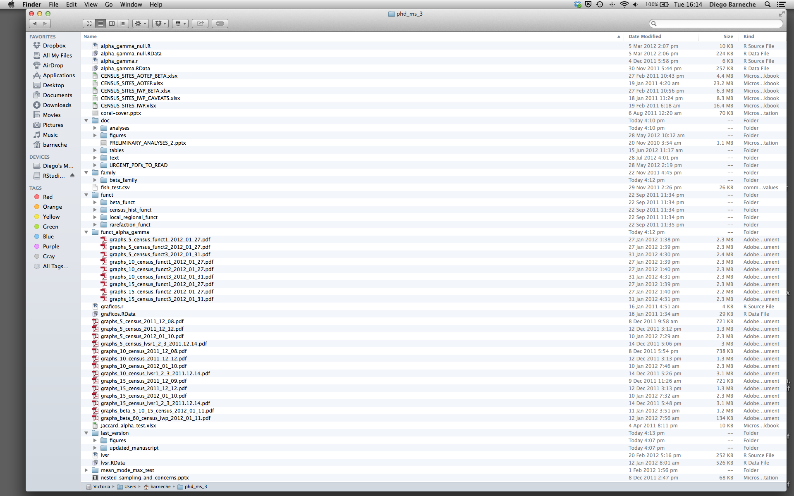

::::::::::::::::::::::::::::::::::::::: objectives

- RStudio で自己完結型のプロジェクトを作成する

::::::::::::::::::::::::::::::::::::::::::::::::::

:::::::::::::::::::::::::::::::::::::::: questions

- R でプロジェクトをどのように管理できますか？

::::::::::::::::::::::::::::::::::::::::::::::::::


## はじめに

科学的なプロセスは本質的に段階的なものであり、多くのプロジェクトはランダムなメモ、一部のコード、次に原稿と進行し、最終的にはすべてが混ざり合ってしまうことがよくあります。

<blockquote class="twitter-tweet"><p>プロジェクトを再現可能な方法で管理することは、科学を再現可能にするだけでなく、生活をより簡単にします。</p>— Vince Buffalo (@vsbuffalo) <a href="https://twitter.com/vsbuffalo/status/323638476153167872">2013年4月15日</a></blockquote>
<script async src="//platform.twitter.com/widgets.js" charset="utf-8"></script>

ほとんどの人はプロジェクトを次のように整理しがちです：

{alt='悪いプロジェクト構成を示すファイルマネージャーのスクリーンショット'}

このような方法を*絶対に*避けるべき理由は数多くあります：

1. データのどのバージョンがオリジナルで、どれが修正済みなのかを区別するのが非常に難しい。
2. 様々な拡張子のファイルが混在して、非常に散らかる。
3. 必要なものを見つけたり、正確なコードで生成した正しい図表を関連付けたりするのに非常に時間がかかる。

良いプロジェクト構成は、最終的に生活をより簡単にします：

- データの整合性を確保しやすくなる。
- 他の人（研究室の同僚、共同研究者、指導教員）とコードを共有するのが簡単になる。
- 原稿の投稿時にコードを簡単にアップロードできる。
- しばらく休んだ後にプロジェクトを再開しやすくなる。

## 考えられる解決策

幸いなことに、作業を効果的に管理するためのツールやパッケージが存在します。

RStudio の最も強力で便利な機能の一つがプロジェクト管理機能です。本日はこれを使って自己完結型の再現可能なプロジェクトを作成します。

:::::::::::::::::::::::::::::::::::::::  challenge

## チャレンジ 1: 自己完結型プロジェクトの作成

RStudio で新しいプロジェクトを作成します：

1. 「File」メニューをクリックし、「New Project」を選択します。
2. 「New Directory」をクリックします。
3. 「New Project」をクリックします。
4. プロジェクトを保存するディレクトリの名前（例：`my_project`）を入力します。
5. 「Create a git repository」のチェックボックスが表示される場合は選択します。
6. 「Create Project」ボタンをクリックします。

::::::::::::::::::::::::::::::::::::::::::::::::::

作成した RStudio プロジェクトを開く最も簡単な方法は、ファイルシステムをたどって保存したディレクトリに移動し、`.Rproj` ファイルをダブルクリックすることです。これにより RStudio が開き、R セッションが `.Rproj` ファイルと同じディレクトリで開始します。データ、プロット、スクリプトはすべてプロジェクトディレクトリに関連付けられます。さらに、RStudio プロジェクトは複数のプロジェクトを同時に開くことが可能で、それぞれのプロジェクトディレクトリに分離されます。これにより、複数のプロジェクトを開いても相互に干渉しません。

:::::::::::::::::::::::::::::::::::::::  challenge

## チャレンジ 2: ファイルシステムを使った RStudio プロジェクトの開き方

1. RStudio を終了します。
2. チャレンジ 1 で作成したプロジェクトのディレクトリに移動します。
3. そのディレクトリ内の `.Rproj` ファイルをダブルクリックします。

::::::::::::::::::::::::::::::::::::::::::::::::::

## プロジェクト管理のベストプラクティス

プロジェクトを整理するための「ベスト」な方法はありませんが、管理を容易にするために従うべきいくつかの一般原則があります：

### データを読み取り専用として扱う

プロジェクトを設定する際の最も重要な目標はこれです。データの収集は通常、時間と費用がかかります。データをインタラクティブに操作する（例：Excel で）と、データの出所や収集後にどのように変更されたかを把握できなくなります。そのため、データを「読み取り専用」として扱うのが良い考えです。

### データのクリーニング

多くの場合、データは「汚れて」おり、R（または他のプログラミング言語）で有用な形式にするために大幅な前処理が必要です。このタスクは「データマンジング」と呼ばれることもあります。これらのスクリプトを別のフォルダに保存し、クリーンなデータセットを保持する「読み取り専用」データフォルダを作成することで、両者の混同を防ぐことができます。

### 生成された出力を使い捨てとみなす

スクリプトによって生成されたものはすべて使い捨てとみなすべきです：スクリプトからすべてを再生成できる必要があります。

出力を管理する方法はたくさんあります。各分析ごとに異なるサブディレクトリを持つ出力フォルダを用意すると、後で便利です。多くの分析は探索的で最終プロジェクトに使用されないことが多く、一部の分析はプロジェクト間で共有されることもあります。

:::::::::::::::::::::::::::::::::::::::::  callout

## ヒント: 科学的コンピューティングのための「十分に良い」実践

[科学的コンピューティングのための「十分に良い」実践](https://github.com/swcarpentry/good-enough-practices-in-scientific-computing/blob/gh-pages/good-enough-practices-for-scientific-computing.pdf) では、プロジェクトの構成について以下の推奨事項を挙げています：

1. 各プロジェクトを専用のディレクトリに配置し、そのディレクトリにプロジェクト名を付ける。
2. プロジェクトに関連するテキスト文書を `doc` ディレクトリに配置する。
3. 生データとメタデータを `data` ディレクトリに、クリーンアップや分析中に生成されたファイルを `results` ディレクトリに配置する。
4. プロジェクトのスクリプトやプログラムのソースを `src` ディレクトリに配置し、他から持ち込んだプログラムやローカルでコンパイルしたプログラムを `bin` ディレクトリに配置する。
5. すべてのファイルに内容や機能を反映した名前を付ける。

::::::::::::::::::::::::::::::::::::::::::::::::::

### 関数の定義と適用を分離する

R を効率的に使用する最も効果的な方法の一つは、最初に .R スクリプトに実行したいコードを書き、RStudio のキーボードショートカットを使用するか「Run」ボタンをクリックして、選択した行をインタラクティブな R コンソールで実行することです。

プロジェクトの初期段階では、最初の .R スクリプトファイルに多くの直接実行されるコード行が含まれることがよくあります。プロジェクトが進むにつれて、再利用可能なコードチャンクが独自の関数に分離されます。これらの関数を保存するためのフォルダと分析スクリプトを保存するためのフォルダを分けるのが良いアイデアです。

### データを data ディレクトリに保存する

良好なディレクト

リ構造ができたら、データファイルを `data/` ディレクトリに保存します。

:::::::::::::::::::::::::::::::::::::::  challenge

## チャレンジ 3

[このリンクから CSV ファイルをダウンロード](data/gapminder_data.csv)してください。

1. ファイルをダウンロードします（上記リンクを右クリック -> 「リンク先を名前を付けて保存」/「名前を付けて保存」、またはリンクをクリックしページが読み込まれた後に <kbd>Ctrl</kbd>+<kbd>S</kbd> を押すか、メニューの「ファイル」 -> 「ページを名前を付けて保存」を選択）。
2. `gapminder_data.csv` という名前で保存されていることを確認します。
3. ファイルをプロジェクト内の `data/` フォルダに保存します。

後ほどこのデータを読み込み、確認します。

::::::::::::::::::::::::::::::::::::::::::::::::::

:::::::::::::::::::::::::::::::::::::::  challenge

## チャレンジ 4

R に読み込む前に、コマンドラインからデータセットについての一般的な情報を得ることは有益です。これにより、R に読み込む際の判断に役立ちます。コマンドラインシェルを使用して以下の質問に答えてください：

1. ファイルのサイズはどれくらいですか？
2. このファイルには何行のデータがありますか？
3. このファイルにはどのような値が含まれていますか？

:::::::::::::::  solution

## チャレンジ 4 の解答

次のコマンドをシェルで実行します：


``` sh
ls -lh data/gapminder_data.csv
```

``` output
-rw-r--r-- 1 runner docker 80K Nov 22 08:04 data/gapminder_data.csv
```

ファイルサイズは 80K です。


``` sh
wc -l data/gapminder_data.csv
```

``` output
1705 data/gapminder_data.csv
```

行数は 1705 行です。データの内容は次のようになります：


``` sh
head data/gapminder_data.csv
```

``` output
country,year,pop,continent,lifeExp,gdpPercap
Afghanistan,1952,8425333,Asia,28.801,779.4453145
Afghanistan,1957,9240934,Asia,30.332,820.8530296
Afghanistan,1962,10267083,Asia,31.997,853.10071
Afghanistan,1967,11537966,Asia,34.02,836.1971382
Afghanistan,1972,13079460,Asia,36.088,739.9811058
Afghanistan,1977,14880372,Asia,38.438,786.11336
Afghanistan,1982,12881816,Asia,39.854,978.0114388
Afghanistan,1987,13867957,Asia,40.822,852.3959448
Afghanistan,1992,16317921,Asia,41.674,649.3413952
```

:::::::::::::::::::::::::

::::::::::::::::::::::::::::::::::::::::::::::::::

:::::::::::::::::::::::::::::::::::::::::  callout

## ヒント: RStudio のコマンドライン

RStudio のコンソールペインにある「Terminal」タブを使用すると、RStudio 内で直接コマンドラインを操作できます。

::::::::::::::::::::::::::::::::::::::::::::::::::

### 作業ディレクトリ

R の現在の作業ディレクトリを知ることは重要です。なぜなら、他のファイルにアクセスする必要があるとき（例：データファイルをインポートする場合）、R は現在の作業ディレクトリを基準にそれらのファイルを探すからです。

新しい RStudio プロジェクトを作成するたびに、そのプロジェクトの新しいディレクトリが作成されます。既存の `.Rproj` ファイルを開くと、そのプロジェクトが開き、R の作業ディレクトリがそのファイルがあるフォルダに設定されます。

:::::::::::::::::::::::::::::::::::::::  challenge

## チャレンジ 5

`getwd()` コマンドを使用するか、RStudio のメニューを使って現在の作業ディレクトリを確認します。

1. コンソールで `getwd()`（"wd" は "working directory" の略）と入力し、Enter を押します。
2. ファイルペインで、`data` フォルダをダブルクリックして開く（または他の任意のフォルダに移動）。作業ディレクトリに戻るには、ファイルペインの「More」をクリックし、「Go To Working Directory」を選択します。

`setwd()` コマンドを使用するか、RStudio のメニューを使って作業ディレクトリを変更します。

1. コンソールで `setwd("data")` と入力し、Enter を押します。その後、`getwd()` と入力して Enter を押し、新しい作業ディレクトリを確認します。
2. RStudio ウィンドウ上部のメニューで「Session」をクリックし、「Set Working Directory」を選択して「Choose Directory」をクリックします。その後、開いたウィンドウでプロジェクトディレクトリに戻り、「Open」をクリックします。コンソールに `setwd` コマンドが自動的に表示されます。

::::::::::::::::::::::::::::::::::::::::::::::::::

:::::::::::::::::::::::::::::::::::::::::  callout

## ヒント: ファイルが存在しないエラー

R コードでファイルを参照しようとして「ファイルが存在しない」というエラーが出た場合は、作業ディレクトリを確認するのが良いです。
ファイルへの絶対パスを指定するか、作業ディレクトリ内（またはそのサブフォルダ）にファイルを保存し、相対パスを指定する必要があります。

::::::::::::::::::::::::::::::::::::::::::::::::::

### バージョン管理

プロジェクトではバージョン管理を使用することが重要です。[RStudio で Git を使用する方法についての良いレッスンはこちら](https://swcarpentry.github.io/git-novice/14-supplemental-rstudio.html)を参照してください。

:::::::::::::::::::::::::::::::::::::::: keypoints

- RStudio を使用して一貫したレイアウトでプロジェクトを作成および管理する。
- 生データを読み取り専用として扱う。
- 生成された出力を使い捨てとみなす。
- 関数の定義と適用を分離する。

::::::::::::::::::::::::::::::::::::::::::::::::::


